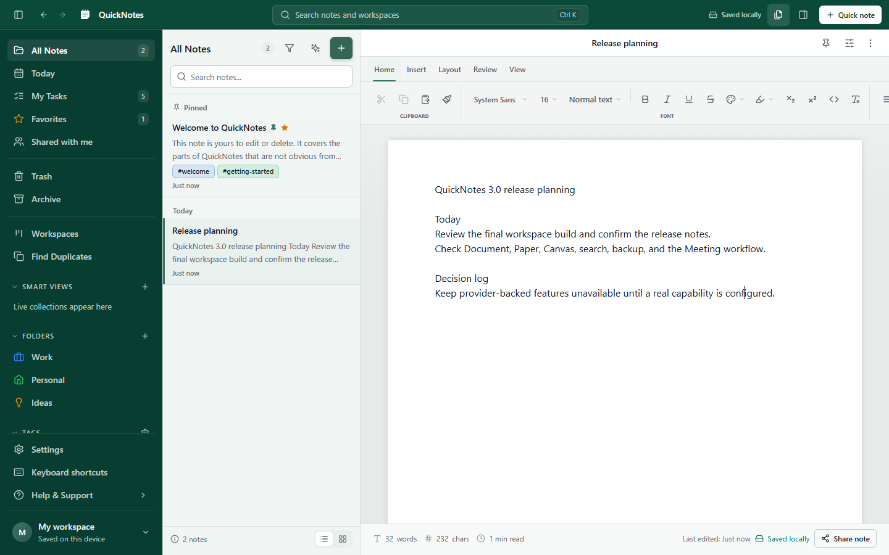
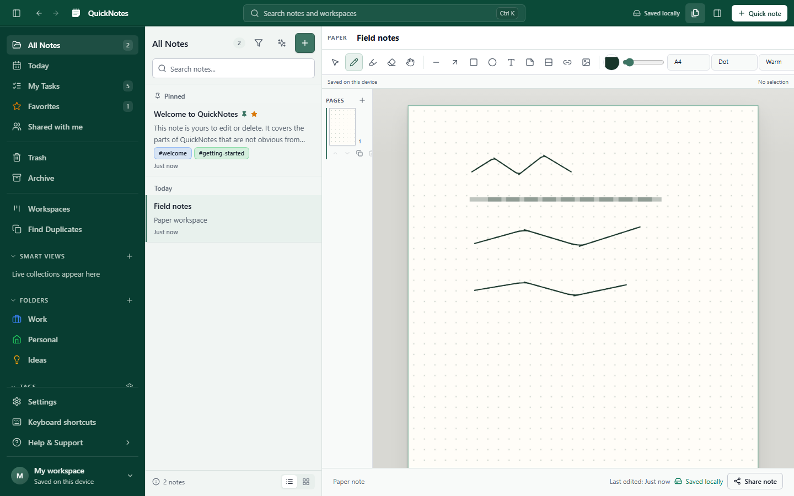
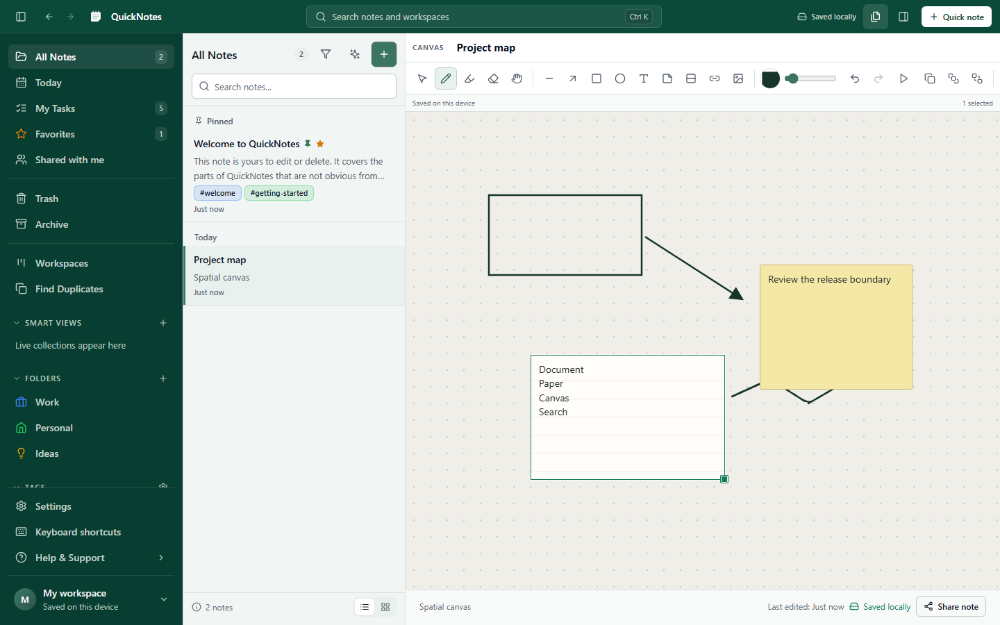
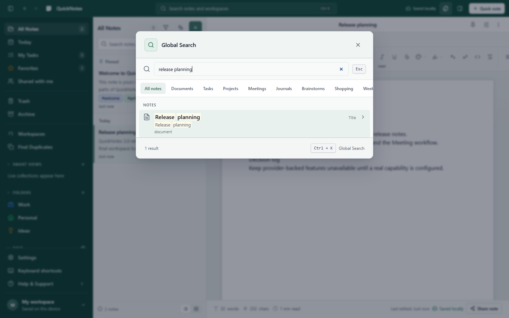
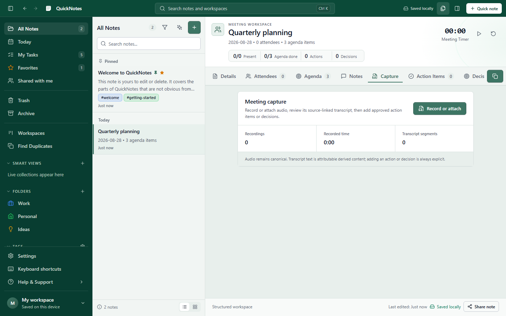

<p align="center">
  
</p>

<h1 align="center">QuickNotes</h1>

<p align="center">A local-first writing, planning, ink, and knowledge workspace for the browser.</p>

<p align="center">
  <a href="https://github.com/BerndHagen/QuickNotes-Simple-Note-Manager/actions/workflows/deploy.yml"></a>
  <a href="https://github.com/BerndHagen/QuickNotes-Simple-Note-Manager/releases/latest"></a>
  <a href="LICENSE"></a>
</p>

QuickNotes 3.0 combines three purpose-built content surfaces with structured daily-work workspaces, fast cross-note retrieval, reliable backup, and optional cloud synchronization. Its core workflows run entirely in the browser with IndexedDB; an account is not required.

[Open the hosted application](https://berndhagen.github.io/QuickNotes-Simple-Note-Manager/) or continue below to run it locally.

## Product tour

<table>
  <tr>
    <th>Document</th>
    <th>Paper</th>
  </tr>
  <tr>
    <td><a href="images/quicknotes-3-document.png"></a></td>
    <td><a href="images/quicknotes-3-paper.png"></a></td>
  </tr>
  <tr>
    <th>Canvas</th>
    <th>Search and knowledge</th>
  </tr>
  <tr>
    <td><a href="images/quicknotes-3-canvas.png"></a></td>
    <td><a href="images/quicknotes-3-search.png"></a></td>
  </tr>
</table>

<p align="center">
  <a href="images/quicknotes-3-meeting.png"></a>
</p>

## What is included

### One application, three content surfaces

- **Document** is a paginated rich-text editor built on Tiptap/ProseMirror. It supports headings, lists and checklists, tables, code, callouts, links, images, document objects, layout controls, outline/navigation, review tools, version history, and PDF export.
- **Paper** is page-oriented. It provides reusable paper sizes, colors and patterns, pressure-aware pen and highlighter strokes, whole-stroke erasing, selection, shapes, text-like objects, page management, undo/redo, replay, and multi-page export.
- **Canvas** is an effectively infinite spatial workspace with pan and zoom, ink, shapes, text, sticky notes, index cards, images, note links, selection, z-order, undo/redo, replay, and export.

The surfaces share the QuickNotes shell, typography, commands, canonical resource model, and data-safety rules without forcing every kind of content into one editor engine.

### Notes, projects, and daily work

- Folders, nested folders, tags, favorites, pins, Trash, list/grid views, reusable templates, and rule-based Smart Views.
- Structured workspaces for task lists, project boards, meetings, journals, brainstorming, shopping, and weekly planning.
- A Task Center that gathers actionable items across compatible workspaces, including priority, due state, recurrence, reminders, and navigation back to the source.
- A Meeting workflow for agenda, notes, decisions, source-linked actions and reminders, recording, live browser transcript where supported, and post-meeting review.
- Light, dark, and system themes with responsive desktop and compact layouts.

### Search and knowledge

- Fast local lexical search across titles, note text, structured workspaces, tags, recognized text, and supported spatial content.
- Type, folder, tag, date, task, reminder, favorite, and pin filtering through search and Smart Views.
- Stable note links, heading/block anchors, backlinks, broken-link reporting, and source return from recognized content or tasks.
- Rebuildable search/link projections: derived-index corruption does not rewrite canonical notes.

Lexical search is complete and independent of any external AI service. Provider-backed embeddings, semantic search, grounded Q&A, and generative actions are intentionally deferred and are not advertised as available features.

### Capture, media, and recognition

- Canonical image, PDF, and audio attachments remain separate from note HTML and structured-note JSON.
- Local printed-image OCR with Tesseract.js and local PDF text extraction with PDF.js; scanned PDF pages can use local OCR.
- Non-destructive image/PDF annotation backed by the same canonical spatial/ink architecture used by Paper and Canvas.
- Browser/operating-system handwriting recognition and live speech recognition when the current platform exposes those capabilities and privacy mode permits them.
- Reviewable recognized text with provider/model provenance, source fingerprints, corrections that preserve machine output, precise source navigation, search indexing, and explicit task creation.
- Audio recording with recoverable chunks, playback, transcript timestamps, and Meeting integration.

Imported-audio transcription through an external provider is capability-gated and unavailable in the hosted release because no paid provider key is configured. QuickNotes never substitutes a mock result or silently sends local content externally.

### Offline, backup, and recovery

- Local-first IndexedDB persistence through Dexie; local workspaces need no account or backend.
- A revisioned service worker supports installed/cached offline reload and safe updates.
- Complete `.qnotes` backup archives include canonical notes, structured data, spatial and annotation graphs, resources and binary payloads, recognized content and corrections, reminders, recording recovery state, and retained version history.
- Imports are bounded and validated before one atomic commit. IDs and internal references are remapped, binary checksums are verified, and unsafe or incomplete graphs are rejected.
- Per-note recovery versions, visible save failures, retryable queues, corrupt-record isolation, and a read-only resource-integrity report support recovery without speculative deletion.

### Optional cloud workspace

Supplying a Supabase project enables authentication, owner-scoped cross-device synchronization, remote version history, sharing, comments, mentions, Storage-backed resources, and Realtime refresh. The application remains useful without it.

Cloud persistence uses separate dependency-ordered outboxes for catalog, spatial, capture, and annotation records. Canonical writes and their outbox mutations are atomic; immutable operation IDs prevent an older acknowledgement from deleting newer work. Concurrent edits and update/delete races create explicit conflict decisions instead of silently choosing by timestamp.

Sharing grants only the documented note and resource access. Shared Paper, Canvas, and annotation content is intentionally read-only for collaborators; QuickNotes does not claim same-object realtime spatial co-editing. Revocation removes remote visibility, and permanent deletion is an explicit tombstone distinct from recoverable Trash.

## Run locally

Requirements: Node.js 20 or newer and npm 10.

```bash
git clone https://github.com/BerndHagen/QuickNotes-Simple-Note-Manager.git
cd QuickNotes-Simple-Note-Manager
npm ci
npm run dev
```

Vite serves the development application at `http://localhost:5173`. Without environment variables, QuickNotes opens as a private local workspace.

### Optional Supabase configuration

Copy `.env.example` to `.env.local` and provide only the public browser configuration:

```dotenv
VITE_SUPABASE_URL=https://your-project.supabase.co
VITE_SUPABASE_ANON_KEY=your-public-anon-key
```

Never put a Supabase `service_role` key or a paid-provider key in a `VITE_` variable. Apply the migrations in [`supabase/migrations`](supabase/migrations/) in filename order and deploy the server functions in [`supabase/functions`](supabase/functions/) when operating a connected workspace. Provider credentials, if added in a future deployment, belong only in server-held function secrets.

The GitHub Pages build uses `/QuickNotes-Simple-Note-Manager/` as its base path. Set `VITE_BASE_PATH=/` for a root deployment or another absolute path for a subdirectory deployment.

## Development and release checks

```bash
npm run lint
npm test
npm run build
npm run test:e2e
npm run test:deployment
npm run validate:release-notes
npm audit --omit=dev
```

Useful focused commands:

```bash
npm run test:watch
npm run benchmark:search
npm run screenshots:update
```

Playwright tests run against the production build/preview and cover Chromium plus mobile WebKit emulation. The repository also includes accessibility, compact-layout, high-DPI spatial, offline/service-worker, migration, backup, account-isolation, conflict, and live-backend validation paths.

## Architecture

QuickNotes separates canonical user data from rebuildable projections:

```text
React workspace shell
  ├─ Document (Tiptap/ProseMirror)
  ├─ Paper and Canvas (shared spatial command/rendering engine)
  └─ Structured editors and capture workflows
              │
              ▼
Zustand visible catalog + Dexie canonical stores and outboxes
              │ optional
              ▼
Supabase Auth, Postgres/RLS, Storage, Realtime, and Edge Functions
```

Key design records:

- [Document, Paper, and Canvas architecture](docs/document-paper-canvas-architecture.md)
- [Knowledge system architecture](docs/knowledge-system-architecture.md)
- [Sync architecture](docs/sync-architecture.md)
- [Backup and restore](docs/backup-restore.md)
- [Data integrity](docs/data-integrity.md)
- [Security model](docs/security-model.md)
- [Known limitations](docs/known-limitations.md)
- [Task 5 release audit](docs/task5-release-audit.md)

## Privacy and security boundaries

- Recognition privacy defaults to **Local only**. Browser-managed or external processing requires the appropriate mode and fresh operation-level consent; local-only never falls back externally.
- Source images, PDFs, audio, notes, and ink remain canonical. Recognition is attributable derived data, and corrections never destroy the machine text or its provenance.
- Rich HTML and external URLs are sanitized/validated. Backup input, sync payloads, provider responses, object geometry, text, and resource sizes are bounded.
- Remote authorization is enforced by Supabase RLS, Storage policies, validation triggers/RPCs, and authenticated functions rather than by hidden client controls.
- Client builds contain only the public Supabase URL/anon key. No production source map or paid-provider secret is shipped.

The connected Supabase Free project does not enable leaked-password screening. This is an accepted operational limitation for the hosted 3.0 release; deployments that require known-compromised-password detection should enable the applicable Supabase Auth plan/setting. See [known limitations](docs/known-limitations.md) for platform and verification boundaries.

## Supported boundaries

- Installed or previously loaded application shells can reload offline; a first-ever visit cannot work offline before assets have been cached.
- Browser handwriting, speech, microphone, and pressure/tilt behavior depend on platform support.
- A `.qnotes` archive is assembled in browser memory, so practical export size depends on the device even though format validation has a higher bound.
- Real Firefox, physical Safari/iOS, stylus hardware, forced operating-system storage eviction, native extreme zoom, and multi-hour physical-device soak testing were not part of the 3.0 automated release gate. No certification for those environments is claimed.
- GitHub Pages cannot set every HTTP-only response security header; configurable production hosts should add CSP and anti-framing headers at the server layer.

## Contributing

Bug reports and focused fixes are welcome through [GitHub Issues](https://github.com/BerndHagen/QuickNotes-Simple-Note-Manager/issues). Use [Discussions](https://github.com/BerndHagen/QuickNotes-Simple-Note-Manager/discussions) for questions and design conversation. Please include reproduction steps, expected and actual behavior, browser/OS details, and any safe console output with defect reports.

## License

QuickNotes is distributed under the [GNU General Public License v3.0](LICENSE).
